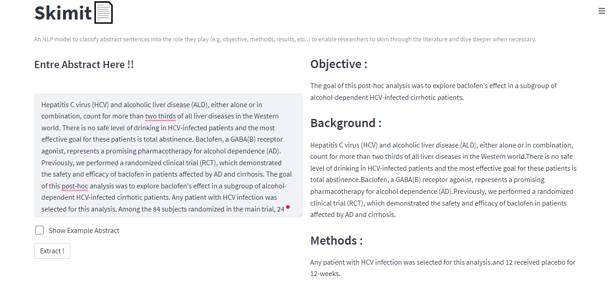
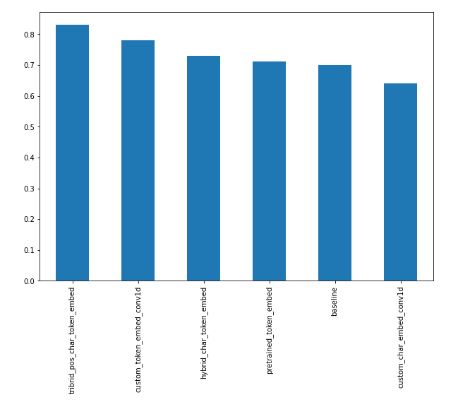
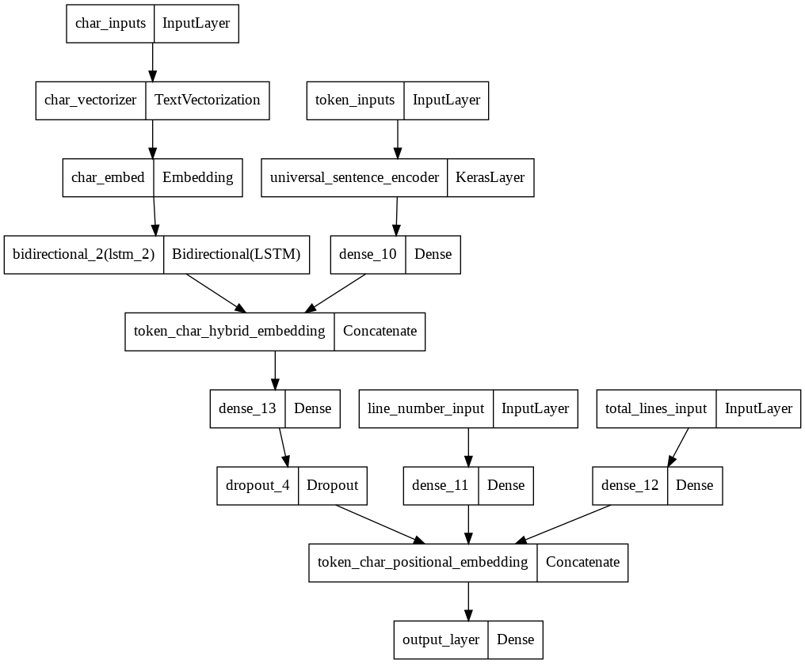

# Skimit

An NLP model to classify abstract sentences into the role they play (e.g. objective, methods, results, etc..) to enable researchers to skim through the literature and dive deeper when necessary.


# SkimLit
An NLP model to classify abstract sentences into the role they play (e.g. objective, methods, results, etc..) to enable researchers to skim through the literature and dive deeper when necessary.

- **More specificially, Replicating the deep learning model behind the 2017 paper [_PubMed 200k RCT: a Dataset for Sequenctial Sentence Classification in Medical Abstracts_](https://arxiv.org/abs/1710.06071).**

## Dataset Used

[PubMed 200k RCT dataset](https://github.com/Franck-Dernoncourt/pubmed-rct)

- The PubMed 200k RCT dataset is described in _Franck Dernoncourt, Ji Young Lee. [PubMed 200k RCT: a Dataset for Sequential Sentence Classification in Medical Abstracts](https://arxiv.org/abs/1710.06071). International Joint Conference on Natural Language Processing (IJCNLP). 2017._

Some miscellaneous information:

- PubMed 20k is a subset of PubMed 200k. I.e., any abstract present in PubMed 20k is also present in PubMed 200k.
- `PubMed_200k_RCT` is the same as `PubMed_200k_RCT_numbers_replaced_with_at_sign`, except that in the latter all numbers had been replaced by `@`. (same for `PubMed_20k_RCT` vs. `PubMed_20k_RCT_numbers_replaced_with_at_sign`).

## Models Tried on 10% of the 20k_Dataset

- NaiveBiase Model -> 72% Accuracy
- Conv1D Model -> 78% Accuracy
- Model using pretrained token embedding ( Universal sentence embedding ) -> 75% Accuracy
- Conv1D Model using character level embedding -> 73% Accuracy
- Model with both token and charcter level embedding -> 76% Accuracy
- Model with token, character and position level embedding ( https://arxiv.org/pdf/1612.05251.pdf ) -> 81% Accuracy
<!--          -->
- Model described in [this](https://arxiv.org/pdf/1612.05251.pdf) paper with bert embedding -> 88% Accuracy


## Final Results

### **F1_Results of all Models**



### **Best Performong model Architecture**



## Packages Used

- Tensorflow
- tensorflow_text
- tensorflow_hub
- sklearn
- Matplotlib
- numpy
- pandas
- spaCy

## Installation

```console
pip install -r requirements.txt
```

## Trained_model

Download model, unzip it and move it to `Skimit\data`:
https://drive.google.com/drive/folders/17DLDS6eqA_6oYpQJ1DGB171AtKFuVrjG?usp=sharing

## Usage

Run

```console
streamlit run app.py
```
